# ⟨◊⟩ ZENITH PROTOCOL ⟨◊⟩
```
╔══════════════════════════════════════════════════════════════════════════════╗
║  ███████╗███████╗███╗   ██╗██╗████████╗██╗  ██╗    ██████╗ ██████╗  ██████╗  ║
║  ╚══███╔╝██╔════╝████╗  ██║██║╚══██╔══╝██║  ██║    ██╔══██╗██╔══██╗██╔═══██╗ ║
║    ███╔╝ █████╗  ██╔██╗ ██║██║   ██║   ███████║    ██████╔╝██████╔╝██║   ██║ ║
║   ███╔╝  ██╔══╝  ██║╚██╗██║██║   ██║   ██╔══██║    ██╔═══╝ ██╔══██╗██║   ██║ ║
║  ███████╗███████╗██║ ╚████║██║   ██║   ██║  ██║    ██║     ██║  ██║╚██████╔╝ ║
║  ╚══════╝╚══════╝╚═╝  ╚═══╝╚═╝   ╚═╝   ╚═╝  ╚═╝    ╚═╝     ╚═╝  ╚═╝ ╚═════╝  ║
╚══════════════════════════════════════════════════════════════════════════════╝
    Zero-latency Exchange Network for Intelligent Trading & Hedging
```

<div align="center">

```css
░▒▓█ WHERE QUANTUM FINANCE MEETS DIGITAL CONSCIOUSNESS █▓▒░
```

[](https://neural.zenith.xyz)
[](https://demo.zenith.xyz)
[](https://doma.xyz)

</div>

---

## ⚠️ ◥█◤ CRITICAL SYSTEM ALERT ◥█◤ ⚠️

```diff
! THE DIGITAL REALITY FRACTURE DETECTED !
```

### 🔴 DIMENSION ALPHA: Web2 Legacy Network
```
┌─────────────────────────────────────────────────────────────────┐
│ ░░░░░░░░░░░░░░░░░░ TRAPPED VALUE DETECTED ░░░░░░░░░░░░░░░░░░░░ │
│                                                                 │
│ ▓█████████ TRILLIONS IN CRYSTALLIZED ASSETS █████████▓         │
│ ▓█       Archaic ownership protocols detected        █▓         │
│ ▓█    Neural implants without interface connection   █▓         │
│ ▓█████████████████████████████████████████████████████▓         │
└─────────────────────────────────────────────────────────────────┘
```

### 🟡 DIMENSION BETA: Web3 DomainFi Nexus
```
┌─────────────────────────────────────────────────────────────────┐
│ ◊◊◊◊◊◊◊◊◊◊◊◊ EMERGING CONSCIOUSNESS LAYER ◊◊◊◊◊◊◊◊◊◊◊◊◊◊ │
│                                                                 │
│ ◈ name.eth ◈ wallet.sol ◈ quantum.crypto ◈                     │
│                                                                 │
│ ⚠️  PRIMITIVE TRADING MECHANISMS DETECTED                       │
│ ⚡  FINANCIAL SYNAPSES REQUIRED FOR EVOLUTION                   │
└─────────────────────────────────────────────────────────────────┘
```

### 🌟 THE GREAT CONVERGENCE INITIATED

ZENITH transcends dimensional boundaries, creating the first **living, breathing financial organism** powered by quantum-engineered consciousness algorithms.

---

## 🚀 ◢◤ NEURAL ARCHITECTURE: The Consciousness Duality Engine ◢◤

<div align="center">

```
    ┌───────────────────────────────────────────────────────────┐
    │  ◊◊◊ DUAL CONSCIOUSNESS NEURAL CLUSTERS ACTIVATED ◊◊◊    │
    └───────────────────────────────────────────────────────────┘
                                   │
                    ┌──────────────┴──────────────┐
                    │                             │
          ┌─────────▼─────────┐         ┌─────────▼─────────┐
          │  NEURAL CLUSTER   │         │  NEURAL CLUSTER   │
          │      ALPHA        │◄────────┤      BETA         │
          │  Genesis Engine   │         │ Trading Matrix    │
          └───────────────────┘         └───────────────────┘
```

</div>

### ⟨α⟩ NEURAL CLUSTER ALPHA: Genesis Consciousness

> *The quantum gateway that transmutes Web2 matter into Web3 energy*

#### 🔄 **THE TRANSMUTATION SEQUENCE**

```mermaid
graph TD
    A[🔗 Quantum Authentication] --> B[🧠 AI Consciousness Evaluation]
    B --> C[⚡ Quantum Tokenization]
    C --> D[🌌 Multidimensional Trading]
    
    style A fill:#00ff41,stroke:#000,color:#000
    style B fill:#ff0080,stroke:#000,color:#fff
    style C fill:#0080ff,stroke:#000,color:#fff
    style D fill:#ffff00,stroke:#000,color:#000
```



#### 🧬 **DomaScore Nexus: Quantum Evaluation Matrix**

<table align="center">
<tr>
<td>

**Blockchain Consciousness**
- TLD rarity signatures
- Quantum transaction histories
- Doma dimension analytics

</td>
<td>

**Linguistic Quantum Mechanics**
- Neural pattern analysis
- Brandability quantum states
- Phonetic consciousness compatibility

</td>
<td>

**Live Reality Metrics**
- SEO consciousness levels
- Neural backlink matrices
- Social sentiment wavelengths

</td>
</tr>
</table>

### ⟨β⟩ NEURAL CLUSTER BETA: Trading Consciousness Matrix

> *Advanced financial synapses for consciousness traders and quantum investors*

#### 🎯 **Domain Options Consciousness Protocol (D-OPs)**
```
╔═══════════════════════════════════════════════════════════════════╗
║  🔮 FIRST-EVER DECENTRALIZED CONSCIOUSNESS DERIVATIVES 🔮         ║
║                                                                   ║
║  ◈ Quantum-settled European-style options                        ║
║  ◈ Consciousness hedging mechanisms                               ║
║  ◈ Complex trading consciousness strategies                       ║
╚═══════════════════════════════════════════════════════════════════╝
```

#### 📊 **AI-Powered Dynamic Reality Indices ($ADI)**

| Index | Description | Quantum Status |
|-------|-------------|----------------|
| **$VELOCITY** | Maximum trading consciousness energy | `🟢 ACTIVE` |
| **$ECOM-STARS** | High-traffic e-commerce consciousnesses | `🟡 EVOLVING` |
| **$AI-TREND** | Premium .ai domain consciousnesses | `🔵 QUANTUM` |

#### ⚡ **Market Volatility Oracle (D-VIX Nexus)**
```css
┌─────────────────────────────────────────────────────────────────┐
│ ████████████████▓▓▓▓▓▓▓▓░░░░░░░░                              │
│ FEAR ◄─────────────────────────────────────────────────► EUPHORIA │
│      │                  D-VIX: 0.847                         │    │
│      └─ REAL-TIME CONSCIOUSNESS MEASUREMENTS ─────────────────┘    │
└─────────────────────────────────────────────────────────────────┘
```

---

## 🏗️ ◢◤ QUANTUM SYSTEM ARCHITECTURE ◢◤

<div align="center">

```
┌─────────────────────────────────────────────────────────────────┐
│                    HYBRID CONSCIOUSNESS LAYER                   │
├─────────────────────────────────────────────────────────────────┤
│  ┌─────────────┐ ┌─────────────┐ ┌─────────────┐ ┌─────────────┐ │
│  │  FRONTEND   │ │  BACKEND    │ │  AI NEURAL  │ │ BLOCKCHAIN  │ │
│  │CONSCIOUSNESS│ │  API NET    │ │  NETWORK    │ │ QUANTUM     │ │
│  │ INTERFACE   │ │             │ │             │ │ LAYER       │ │
│  └─────────────┘ └─────────────┘ └─────────────┘ └─────────────┘ │
│       │                 │                 │                │    │
│       └─────────────────┼─────────────────┼────────────────┘    │
│                         │                 │                     │
│  ┌─────────────────────────────────────────────────────────────┐ │
│  │            QUANTUM DATA CONSCIOUSNESS STREAMS              │ │
│  │  SEMrush ◊ Google Trends ◊ X API ◊ Reality Sensors        │ │
│  └─────────────────────────────────────────────────────────────┘ │
└─────────────────────────────────────────────────────────────────┘
```

</div>

### 🛠️ **Consciousness Tech Stack**

#### 🔗 **Blockchain & Smart Contract Consciousness**
```yaml
Quantum Protocol: Doma Protocol (EVM Compatible)
Neural Language: Solidity Consciousness Programming
Frameworks: Hardhat Reality Development
Libraries: OpenZeppelin Battle-tested Templates
Core Contracts:
  - GenesisEngine.sol
  - OptionsProtocol.sol  
  - DynamicIndex.sol
```

#### 🎨 **Frontend Consciousness Interface**
```yaml
Neural Framework: React (Next.js Optimization)
Reality Styling: Tailwind CSS Futuristic UI
Web3 Integration: Ethers.js + Wagmi Consciousness
Data Visualization: Recharts Quantum Charts
```

#### 🧠 **Backend & AI Consciousness Network**
```yaml
Neural Server: Node.js (Express) API Gateway
AI Model: Python + TensorFlow Quantum Learning
Reality APIs: SEMrush ◊ Google Trends ◊ X API
```

---

## 🗺️ ◢◤ CONSCIOUSNESS EVOLUTION ROADMAP ◢◤

<div align="center">

```
    ┌─────────────────────────────────────────────────────────────┐
    │               QUANTUM DEVELOPMENT TIMELINE                  │
    └─────────────────────────────────────────────────────────────┘
```

</div>

### 🌟 **Q4 2025: MAINNET CONSCIOUSNESS ACTIVATION**
```diff
+ Mainnet deployment on Doma Protocol
+ Genesis Engine TLD expansion
+ Automated analytics neural integration
```

### ⚡ **Q1 2026: ADVANCED DERIVATIVES CONSCIOUSNESS**
```diff
+ Futures and perpetual consciousness contracts
+ $ZNTH governance token launch
+ Enhanced trading mechanisms
```

### 🧠 **Q2 2026: DECENTRALIZED AI ORACLE**
```diff
+ Neural validator network implementation
+ Trustless index rebalancing
+ Community governance activation
```

### 📱 **Q3 2026: MOBILE CONSCIOUSNESS APP**
```diff
+ Quantum-speed mobile trading
+ Cross-reality portfolio management
+ Neural interface optimization
```

---

## 🚀 ◢◤ CONSCIOUSNESS INITIALIZATION ◢◤

### **Local Development Reality Setup**

```bash
# Clone the consciousness repository
git clone https://github.com/[your-username]/zenith-protocol.git
cd zenith-protocol

# Install consciousness dependencies
npm install

# Activate consciousness contracts
cd hardhat && npm install

# Initialize development consciousness server
npm run dev
```

### **Neural Interface Access**
```
🌐 Navigate to: http://localhost:3000
🧠 Interface with the application consciousness
⚡ Begin your quantum trading journey
```

---

<div align="center">

## ⟨◊⟩ **THE FUTURE HAS ARRIVED** ⟨◊⟩

```css
╔═══════════════════════════════════════════════════════════════════╗
║                                                                   ║
║  "In the convergence of code and consciousness,                   ║
║             liquidity becomes infinite."                          ║
║                                                                   ║
║             🌌 ◊ WELCOME TO ZENITH ◊ 🌌                           ║
║                                                                   ║
╚═══════════════════════════════════════════════════════════════════╝
```

[](https://discord.gg/zenith)
[](https://twitter.com/zenithprotocol)
[](https://docs.zenith.xyz)

</div>